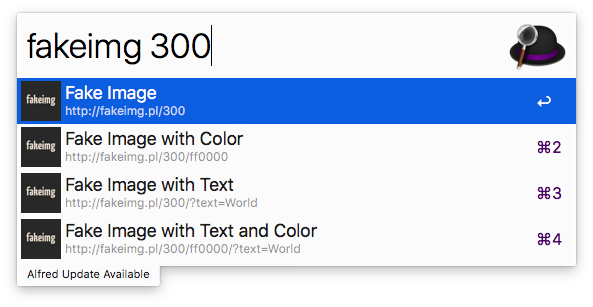

# alfred-fakeimg [](https://travis-ci.org/ctxhou/alfred-fakeimg)

> [Alfred 3](https://www.alfredapp.com) workflow to generate fakeimg.pl image link



## Install

```
$ npm install -g alfred-fakeimg
```

*Requires [Node.js](https://nodejs.org) 4+ and the Alfred [Powerpack](https://www.alfredapp.com/powerpack/).*


## Usage

In Alfred, type `fakeimg` <kbd>Enter</kbd>, and your query the image size to get fakeimg link.

Select an item and press <kbd>Enter</kbd> to get link.

## Related

- [alfy](https://github.com/sindresorhus/alfy) - Create Alfred workflows with ease

## License

MIT © [ctxhou](https://github.com/ctxhou/alfred-fakeimg)
